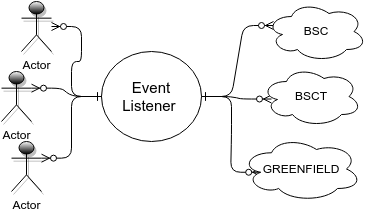
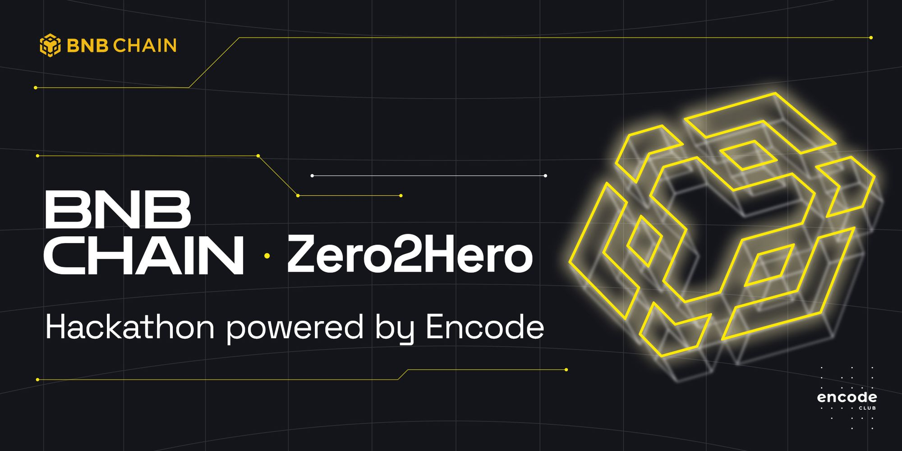

# Multi-chain EVM event Listener.

The Multi-Chain Event Listener is an application that allows you to monitor wallet and contract activities across multiple blockchain networks via a Telegram Bot. You can try this bot in action at [@BinanceTxSpyBot](https://t.me/BinanceTxSpyBot). This README provides an overview of the app and guides on how to use and implement this techniqu

<p align="center">
    
</p>

Project in its conceptual stage and future development can be broken down into two parts:

* Adding an intuitive modular UI for dynamic interaction with multiple chains, contracts, and wallets.
* Creating scalable and memory-efficient backend logic to store users data.

## Application Overview

The application is set up with listeners for different blockchain networks (BSC, BSCT, ETH, GFD). These listeners are constantly monitoring the blockchain for transactions related to the wallets you've specified. Once a transaction is detected, a message is sent to the corresponding chat on Telegram.

<p align="center">
    
</p>
The components directory contains handlers managing addresses, bot interactions, and contracts. The networks directory holds JavaScript files for each blockchain network (BSC, BSCT, ETH, GFD) that define listeners for transaction monitoring.

At the root level, main.js orchestrates the application, while Dockerfile and .dockerignore are used for Docker-based deployment. The package.json file handles the project's dependencies.

```txt
MT_Listener /
    |---- components/			              
        | ---- addrHandler.js                  
        | ---- botHandler.js 
        | ---- contractsHandler.js 
    |---- networks/			                  
        |---- BSC.js		          
        |---- BSCt.js		        
        |---- ETH.js		   
        |---- GFD.js	  
    |---- .dockerignore		                  
    |---- main.js		                
    |---- package.json		      
    |---- Dockerfile	      
```

## Deploy with Docker
Prerequisites
Before proceeding, ensure that you have the following prerequisites installed on your system:

- [Doker](https://docs.docker.com/engine/install/)
- BOT_KEY - You can obtaine it from [@BotFather](https://t.me/BotFather). Use in .env

Download repo and start application in container.


```
# Dowload repository
git clone https://github.com/doma2k/MT_Listener.git && cd MT_Listener

# Create Docker image
sudo docker build . -t mc_listener 

# Start new container 
docker run -p 8080:8080 mc_listener 

# Stop container 
docker kill mc_listener 
```
## Contributions

Feel free to create issues and pull requests.

When creating pull requests, **more is more:** I'd like to see ten small pull requests separated by feature rather than all those combined into a huge one.

## License
```
Multi-Chain Event Listener
Copyright (c) 2023 Kyrylo Doma.
Discord: doma2k | Doma🏠Nodes#4006
Telegram: @domanodes

Licensed under the Apache License, Version 2.0 (the "License");
you may not use this file except in compliance with the License.
You may obtain a copy of the License at

http://www.apache.org/licenses/LICENSE-2.0

Unless required by applicable law or agreed to in writing, software
distributed under the License is distributed on an "AS IS" BASIS,
WITHOUT WARRANTIES OR CONDITIONS OF ANY KIND, either express or implied.
See the License for the specific language governing permissions and
limitations under the License.
```

### Pawerd by Binance [**ZERO2HERO**](https://encodeclub.notion.site/BNB-Chain-Zero2Hero-Hackathon-powered-by-Encode-Club-Hacker-Pack-945126fc911f4b65b1b13ae154c96e33)
<p align="left">
    
</p>